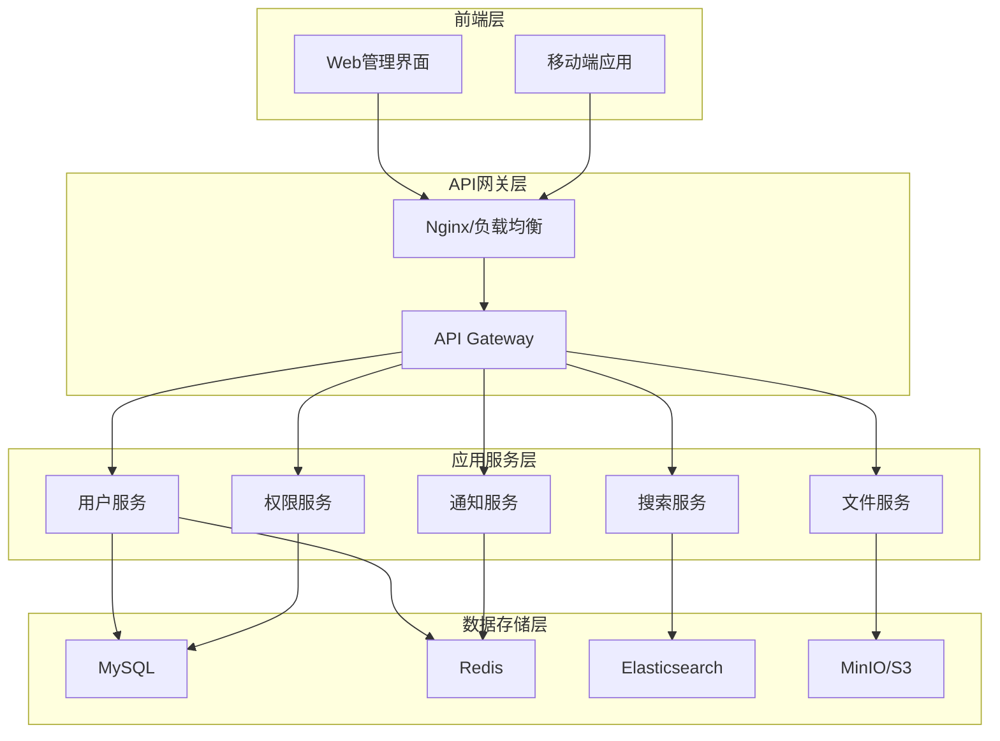

# DocSphere

[](LICENSE)
[](https://nodejs.org/)
[](https://reactjs.org/)

DocSphere是一款专为现代企业设计的智能文档管理系统，旨在简化企业内部文件的存储、共享和协作流程。通过直观的用户界面和强大的功能，DocSphere帮助团队高效组织、安全管理和便捷访问企业知识资产。

系统采用前后端分离架构，提供响应式设计，确保用户在任何设备上都能获得一致的优质体验。DocSphere的核心理念是"连接人与知识"，通过智能的权限管理和搜索功能，确保正确的信息能够及时送达需要它的人手中。

## ✨ 核心特性

### 🚀 文件管理
- **多格式支持**: 支持文档、图片、视频等多种文件格式
- **大文件上传**: 支持分片上传，最大支持2GB文件
- **文件预览**: 内置文件预览功能，支持PDF、图片、视频等
- **智能搜索**: 基于Elasticsearch的全文搜索和标签搜索
- **版本管理**: 文件版本控制和历史记录

### 🔐 权限控制
- **RBAC权限模型**: 基于角色的访问控制
- **细粒度权限**: 文件和文件夹级别的权限管理
- **权限继承**: 支持权限自动继承和覆盖
- **临时权限**: 支持设置权限过期时间
- **审计日志**: 完整的权限变更和访问日志

### 👥 协作功能
- **文件分享**: 生成分享链接，支持密码保护和有效期
- **部门管理**: 支持层级部门结构
- **用户组管理**: 灵活的用户分组和权限分配
- **实时协作**: 支持多用户同时编辑和评论

### 🎨 用户体验
- **现代化UI**: 基于Ant Design的企业级界面设计
- **响应式设计**: 完美适配桌面和移动设备
- **主题切换**: 支持明暗主题切换
- **国际化**: 支持多语言界面

### 🛠️ 管理功能
- **用户管理**: 完整的用户生命周期管理
- **系统监控**: 实时系统状态监控和性能分析
- **数据统计**: 详细的文件使用和用户行为统计
- **批量操作**: 支持文件批量上传、删除、移动等操作

## 🏗️ 系统架构

### 技术栈

**后端技术栈**
- **框架**: Node.js + Express.js
- **数据库**: MySQL 8.0 + Redis 6.0
- **搜索**: Elasticsearch 8.x
- **文件存储**: MinIO (S3兼容)
- **消息队列**: RabbitMQ
- **认证**: JWT + OAuth2

**前端技术栈**
- **框架**: React 18 + TypeScript
- **状态管理**: Redux Toolkit + RTK Query
- **UI组件**: Ant Design 5.x
- **构建工具**: Vite
- **路由**: React Router 6

**开发工具**
- **包管理**: pnpm
- **代码规范**: ESLint + Prettier
- **测试**: Jest + React Testing Library
- **容器化**: Docker + Docker Compose

### 架构图



## 📚 文档

### 架构文档
- [系统架构概述](./docs/architecture/system-overview.md) - 整体架构设计和系统概述
- [技术栈选择](./docs/architecture/tech-stack.md) - 技术选型说明和对比
- [权限控制系统](./docs/architecture/permission-control.md) - 权限模型设计和实现

### 数据库文档
- [数据库设计](./docs/database/schema-design.md) - 数据库表结构设计
- [数据迁移指南](./docs/database/migration.md) - 数据库迁移脚本和说明

### API文档
- [API接口规范](./docs/api/api-specification.md) - RESTful API文档
- [API变更日志](./docs/api/changelog.md) - API版本更新记录

### 前端文档
- [前端架构设计](./docs/frontend/frontend-architecture.md) - 前端架构和组件设计
- [组件开发指南](./docs/frontend/component-guide.md) - 组件开发规范和最佳实践

### 开发指南
- [快速开始](./docs/guides/quick-start.md) - 项目搭建和开发环境配置
- [部署指南](./docs/guides/deployment.md) - 生产环境部署说明
- [贡献指南](./docs/guides/contributing.md) - 开发贡献流程和规范

## 🚀 快速开始

### 环境要求
- Node.js >= 18.0.0
- MySQL >= 8.0
- Redis >= 6.0
- Elasticsearch >= 8.0
- MinIO 或其他S3兼容存储

### 本地开发

1. **克隆项目**
```bash
git clone https://github.com/your-org/docsphere.git
cd docsphere
```

2. **安装依赖**
```bash
# 安装后端依赖
cd backend
pnpm install

# 安装前端依赖
cd ../frontend
pnpm install
```

3. **配置环境变量**
```bash
# 复制环境变量模板
cp .env.example .env

# 编辑环境变量
vim .env
```

4. **启动数据库服务**
```bash
# 使用Docker Compose启动数据库
docker-compose up -d mysql redis elasticsearch minio
```

5. **运行数据库迁移**
```bash
cd backend
pnpm run migrate
```

6. **启动开发服务器**
```bash
# 启动后端服务
cd backend
pnpm run dev

# 启动前端服务
cd frontend
pnpm run dev
```

7. **访问应用**
- 前端界面: http://localhost:3000
- API文档: http://localhost:8000/api-docs
- 管理后台: http://localhost:3000/admin

### Docker部署

```bash
# 构建和启动所有服务
docker-compose up -d

# 查看服务状态
docker-compose ps

# 查看日志
docker-compose logs -f
```

## 📊 项目结构

```
docsphere/
├── backend/                 # 后端服务
│   ├── src/
│   │   ├── controllers/     # 控制器
│   │   ├── services/        # 业务逻辑
│   │   ├── models/          # 数据模型
│   │   ├── middleware/      # 中间件
│   │   ├── routes/          # 路由定义
│   │   ├── utils/           # 工具函数
│   │   └── config/          # 配置文件
│   ├── tests/               # 测试文件
│   └── migrations/          # 数据库迁移
├── frontend/                # 前端应用
│   ├── src/
│   │   ├── components/      # 通用组件
│   │   ├── pages/           # 页面组件
│   │   ├── hooks/           # 自定义Hooks
│   │   ├── services/        # API服务
│   │   ├── store/           # 状态管理
│   │   ├── utils/           # 工具函数
│   │   └── styles/          # 样式文件
│   └── public/              # 静态资源
├── docs/                    # 项目文档
│   ├── architecture/        # 架构文档
│   ├── api/                 # API文档
│   ├── database/            # 数据库文档
│   ├── frontend/            # 前端文档
│   └── guides/              # 开发指南
├── docker-compose.yml       # Docker编排文件
├── .github/                 # GitHub Actions配置
└── README.md               # 项目说明
```

## 🔧 配置说明

### 环境变量配置

```bash
# 应用配置
NODE_ENV=development
PORT=8000
JWT_SECRET=your-jwt-secret
JWT_EXPIRES_IN=24h

# 数据库配置
DB_HOST=localhost
DB_PORT=3306
DB_NAME=docsphere
DB_USER=root
DB_PASSWORD=password

# Redis配置
REDIS_HOST=localhost
REDIS_PORT=6379
REDIS_PASSWORD=

# 文件存储配置
MINIO_ENDPOINT=localhost
MINIO_PORT=9000
MINIO_ACCESS_KEY=minioadmin
MINIO_SECRET_KEY=minioadmin
MINIO_BUCKET=docsphere

# Elasticsearch配置
ELASTICSEARCH_HOST=localhost
ELASTICSEARCH_PORT=9200
```

## 🧪 测试

```bash
# 运行后端测试
cd backend
pnpm run test

# 运行前端测试
cd frontend
pnpm run test

# 运行集成测试
pnpm run test:integration

# 生成测试覆盖率报告
pnpm run test:coverage
```

## 📈 性能指标

- **并发用户**: 支持1000+并发用户
- **文件上传**: 支持大文件上传（最大2GB）
- **响应时间**: API响应时间<200ms
- **可用性**: 99.9%系统可用性
- **存储容量**: 支持PB级文件存储

## 🛡️ 安全特性

- **认证授权**: JWT + OAuth2.0认证机制
- **数据传输**: HTTPS加密传输
- **数据存储**: 数据库字段加密存储
- **访问控制**: 细粒度的权限控制
- **安全审计**: 完整的操作日志记录
- **防护措施**: 防SQL注入、XSS、CSRF攻击

## 🤝 贡献

我们欢迎所有形式的贡献，包括但不限于：

- 🐛 报告Bug
- 💡 提出新功能建议
- 📝 改进文档
- 🔧 提交代码修复
- 🧪 添加测试用例

请查看 [贡献指南](./docs/guides/contributing.md) 了解详细的贡献流程。

## 📄 许可证

本项目采用 [MIT 许可证](LICENSE)。

## 🙏 致谢

感谢以下开源项目的支持：
- [React](https://reactjs.org/) - 用户界面库
- [Ant Design](https://ant.design/) - 企业级UI设计语言
- [Express.js](https://expressjs.com/) - Web应用框架
- [MySQL](https://www.mysql.com/) - 关系型数据库
- [Redis](https://redis.io/) - 内存数据库
- [Elasticsearch](https://www.elastic.co/) - 搜索引擎

## 📞 联系我们

- 项目主页: https://github.com/your-org/docsphere
- 问题反馈: https://github.com/your-org/docsphere/issues
- 邮箱: support@docsphere.com
- 官网: https://docsphere.com

---

⭐ 如果这个项目对你有帮助，请给我们一个星标！
