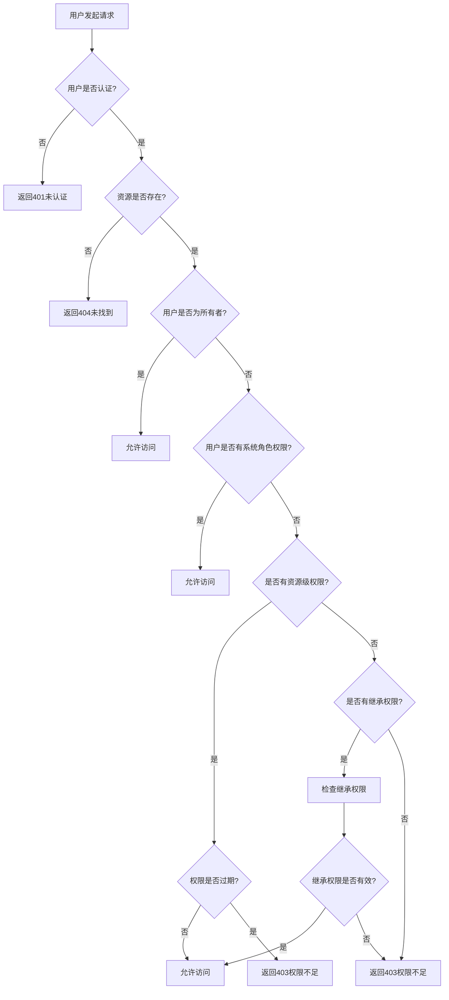

# 权限控制系统设计

## 概述

DocSphere 权限控制系统采用基于角色的访问控制（RBAC）模型，结合资源级权限管理，提供细粒度的权限控制能力。系统支持权限继承、临时权限和权限审计，确保企业级应用的安全性和灵活性。

## 权限模型设计

### 核心概念

#### 1. 用户（User）
- 系统的使用者
- 拥有基本身份信息
- 可以属于多个用户组或部门

#### 2. 角色（Role）
- 权限的集合
- 预定义的角色模板
- 支持角色层级继承

#### 3. 资源（Resource）
- 系统中的保护对象
- 包括文件、文件夹、系统配置等
- 支持资源层级结构

#### 4. 权限（Permission）
- 对资源的操作许可
- 基本的权限类型：读取、写入、删除、分享、管理
- 支持自定义权限类型

#### 5. 权限授予（Grant）
- 将权限分配给用户或角色
- 支持临时权限和权限过期
- 记录权限授予历史

### 权限类型定义

```typescript
// 基础权限类型
enum PermissionType {
  READ = 'read',           // 读取权限
  WRITE = 'write',         // 写入权限
  DELETE = 'delete',       // 删除权限
  SHARE = 'share',         // 分享权限
  ADMIN = 'admin',         // 管理权限
  DOWNLOAD = 'download',   // 下载权限
  PREVIEW = 'preview',     // 预览权限
  COMMENT = 'comment'      // 评论权限
}

// 资源类型
enum ResourceType {
  FILE = 'file',
  FOLDER = 'folder',
  SHARE = 'share',
  USER = 'user',
  SYSTEM = 'system'
}

// 预定义角色
enum SystemRole {
  ADMIN = 'admin',         // 系统管理员
  USER_MANAGER = 'user_manager',  // 用户管理员
  FILE_MANAGER = 'file_manager',  // 文件管理员
  REGULAR_USER = 'user',   // 普通用户
  GUEST = 'guest'          // 访客
}
```

## 权限控制架构

### 权限检查流程



### 权限数据模型

#### 权限表设计
```sql
-- 用户角色关联表
CREATE TABLE user_roles (
    id BIGINT PRIMARY KEY AUTO_INCREMENT,
    user_id BIGINT NOT NULL,
    role_name VARCHAR(50) NOT NULL,
    granted_by BIGINT NOT NULL,
    granted_at TIMESTAMP DEFAULT CURRENT_TIMESTAMP,
    expires_at TIMESTAMP NULL,
    is_active BOOLEAN DEFAULT TRUE,

    UNIQUE KEY unique_user_role (user_id, role_name),
    INDEX idx_user (user_id),
    INDEX idx_role (role_name),
    FOREIGN KEY (user_id) REFERENCES users(id) ON DELETE CASCADE,
    FOREIGN KEY (granted_by) REFERENCES users(id)
);

-- 资源权限表
CREATE TABLE resource_permissions (
    id BIGINT PRIMARY KEY AUTO_INCREMENT,
    user_id BIGINT NOT NULL,
    resource_type ENUM('file', 'folder', 'share') NOT NULL,
    resource_id BIGINT NOT NULL,
    permission_type ENUM('read', 'write', 'delete', 'share', 'admin') NOT NULL,
    granted_by BIGINT NOT NULL,
    is_inherited BOOLEAN DEFAULT FALSE,
    inherit_from_resource_id BIGINT NULL,
    expires_at TIMESTAMP NULL,
    created_at TIMESTAMP DEFAULT CURRENT_TIMESTAMP,
    updated_at TIMESTAMP DEFAULT CURRENT_TIMESTAMP ON UPDATE CURRENT_TIMESTAMP,

    UNIQUE KEY unique_permission (user_id, resource_type, resource_id, permission_type),
    INDEX idx_user_resource (user_id, resource_type, resource_id),
    INDEX idx_resource (resource_type, resource_id),
    FOREIGN KEY (user_id) REFERENCES users(id) ON DELETE CASCADE,
    FOREIGN KEY (granted_by) REFERENCES users(id)
);

-- 权限继承规则表
CREATE TABLE permission_inheritance_rules (
    id BIGINT PRIMARY KEY AUTO_INCREMENT,
    resource_type VARCHAR(50) NOT NULL,
    permission_type VARCHAR(50) NOT NULL,
    can_inherit BOOLEAN DEFAULT TRUE,
    inherit_depth INT DEFAULT 10,
    created_at TIMESTAMP DEFAULT CURRENT_TIMESTAMP,

    UNIQUE KEY unique_rule (resource_type, permission_type)
);
```

## 后端权限实现

### 权限服务设计

```typescript
interface PermissionService {
  // 权限检查
  checkPermission(userId: string, resourceId: string, resourceType: ResourceType, permission: PermissionType): Promise<boolean>;

  // 权限授予
  grantPermission(params: GrantPermissionParams): Promise<Permission>;

  // 权限撤销
  revokePermission(permissionId: string): Promise<void>;

  // 获取用户权限
  getUserPermissions(userId: string, resourceType?: ResourceType): Promise<Permission[]>;

  // 获取资源权限
  getResourcePermissions(resourceType: ResourceType, resourceId: string): Promise<Permission[]>;

  // 权限继承检查
  getInheritedPermissions(userId: string, resourceType: ResourceType, resourceId: string): Promise<Permission[]>;
}
```

### 权限检查实现

```typescript
export class PermissionServiceImpl implements PermissionService {
  constructor(
    private permissionRepository: PermissionRepository,
    private userRepository: UserRepository,
    private cacheService: CacheService
  ) {}

  async checkPermission(
    userId: string,
    resourceId: string,
    resourceType: ResourceType,
    permission: PermissionType
  ): Promise<boolean> {
    // 1. 检查缓存
    const cacheKey = `perm:${userId}:${resourceType}:${resourceId}:${permission}`;
    const cached = await this.cacheService.get(cacheKey);
    if (cached !== null) {
      return cached === 'true';
    }

    // 2. 检查用户是否为资源所有者
    const isOwner = await this.checkOwnership(userId, resourceType, resourceId);
    if (isOwner) {
      await this.cacheService.set(cacheKey, 'true', 300); // 缓存5分钟
      return true;
    }

    // 3. 检查系统角色权限
    const hasSystemRolePermission = await this.checkSystemRolePermission(userId, permission);
    if (hasSystemRolePermission) {
      await this.cacheService.set(cacheKey, 'true', 300);
      return true;
    }

    // 4. 检查直接权限
    const hasDirectPermission = await this.checkDirectPermission(userId, resourceId, resourceType, permission);
    if (hasDirectPermission) {
      await this.cacheService.set(cacheKey, 'true', 300);
      return true;
    }

    // 5. 检查继承权限
    const hasInheritedPermission = await this.checkInheritedPermission(userId, resourceId, resourceType, permission);

    // 缓存结果
    await this.cacheService.set(cacheKey, hasInheritedPermission.toString(), 300);
    return hasInheritedPermission;
  }

  private async checkOwnership(userId: string, resourceType: ResourceType, resourceId: string): Promise<boolean> {
    switch (resourceType) {
      case ResourceType.FILE:
        const file = await this.fileRepository.findById(resourceId);
        return file?.ownerId === userId;

      case ResourceType.FOLDER:
        const folder = await this.folderRepository.findById(resourceId);
        return folder?.ownerId === userId;

      default:
        return false;
    }
  }

  private async checkSystemRolePermission(userId: string, permission: PermissionType): Promise<boolean> {
    const userRoles = await this.userRepository.getUserRoles(userId);

    // 管理员拥有所有权限
    if (userRoles.includes(SystemRole.ADMIN)) {
      return true;
    }

    // 根据角色和权限映射检查
    const rolePermissionMap = {
      [SystemRole.FILE_MANAGER]: [PermissionType.READ, PermissionType.WRITE, PermissionType.DELETE],
      [SystemRole.USER_MANAGER]: [PermissionType.READ, PermissionType.WRITE],
      [SystemRole.REGULAR_USER]: [PermissionType.READ, PermissionType.WRITE]
    };

    for (const role of userRoles) {
      const rolePermissions = rolePermissionMap[role] || [];
      if (rolePermissions.includes(permission)) {
        return true;
      }
    }

    return false;
  }

  private async checkDirectPermission(
    userId: string,
    resourceId: string,
    resourceType: ResourceType,
    permission: PermissionType
  ): Promise<boolean> {
    const permissionRecord = await this.permissionRepository.findDirectPermission(
      userId, resourceId, resourceType, permission
    );

    if (!permissionRecord) {
      return false;
    }

    // 检查权限是否过期
    if (permissionRecord.expiresAt && permissionRecord.expiresAt < new Date()) {
      return false;
    }

    return permissionRecord.isActive;
  }

  private async checkInheritedPermission(
    userId: string,
    resourceId: string,
    resourceType: ResourceType,
    permission: PermissionType
  ): Promise<boolean> {
    // 只对文件夹进行权限继承检查
    if (resourceType !== ResourceType.FOLDER) {
      return false;
    }

    // 获取文件夹的父级路径
    const folderPath = await this.getFolderPath(resourceId);

    // 从父级开始检查继承权限
    for (const ancestorFolderId of folderPath) {
      const hasPermission = await this.checkDirectPermission(userId, ancestorFolderId, ResourceType.FOLDER, permission);
      if (hasPermission) {
        // 检查该权限是否可继承
        const canInherit = await this.checkPermissionInheritance(ResourceType.FOLDER, permission);
        if (canInherit) {
          return true;
        }
      }
    }

    return false;
  }
}
```

### 权限中间件

```typescript
// Express 权限检查中间件
export const requirePermission = (
  permission: PermissionType,
  resourceType: ResourceType,
  resourceIdParam: string = 'id'
) => {
  return async (req: Request, res: Response, next: NextFunction) => {
    try {
      const userId = req.user?.id;
      const resourceId = req.params[resourceIdParam];

      if (!userId || !resourceId) {
        return res.status(400).json({
          success: false,
          message: '用户ID或资源ID缺失'
        });
      }

      const permissionService = req.app.get('permissionService');
      const hasPermission = await permissionService.checkPermission(
        userId, resourceId, resourceType, permission
      );

      if (!hasPermission) {
        return res.status(403).json({
          success: false,
          message: '权限不足'
        });
      }

      next();
    } catch (error) {
      console.error('权限检查错误:', error);
      res.status(500).json({
        success: false,
        message: '服务器内部错误'
      });
    }
  };
};

// 使用示例
app.get('/api/files/:id',
  authenticateToken,
  requirePermission(PermissionType.READ, ResourceType.FILE),
  getFileController
);

app.delete('/api/files/:id',
  authenticateToken,
  requirePermission(PermissionType.DELETE, ResourceType.FILE),
  deleteFileController
);
```

## 前端权限控制

### 权限检查 Hook

```typescript
export const usePermission = (resourceId: string, resourceType: ResourceType) => {
  const { user } = useAuth();
  const [permissions, setPermissions] = useState<PermissionType[]>([]);
  const [loading, setLoading] = useState(true);
  const [error, setError] = useState<Error | null>(null);

  useEffect(() => {
    const loadPermissions = async () => {
      try {
        setLoading(true);
        const permissionData = await permissionService.getResourcePermissions(
          resourceType,
          resourceId
        );

        const userPermissions = permissionData.filter(p => p.userId === user.id);
        setPermissions(userPermissions.map(p => p.permissionType));
      } catch (err) {
        setError(err as Error);
      } finally {
        setLoading(false);
      }
    };

    if (resourceId && resourceType) {
      loadPermissions();
    }
  }, [resourceId, resourceType, user.id]);

  const checkPermission = useCallback((permission: PermissionType): boolean => {
    // 管理员拥有所有权限
    if (user?.role === SystemRole.ADMIN) {
      return true;
    }

    // 检查资源权限
    if (permissions.includes(permission)) {
      return true;
    }

    return false;
  }, [permissions, user?.role]);

  const checkMultiplePermissions = useCallback((requiredPermissions: PermissionType[]): boolean => {
    return requiredPermissions.every(permission => checkPermission(permission));
  }, [checkPermission]);

  const checkAnyPermission = useCallback((requiredPermissions: PermissionType[]): boolean => {
    return requiredPermissions.some(permission => checkPermission(permission));
  }, [checkPermission]);

  return {
    permissions,
    loading,
    error,
    checkPermission,
    checkMultiplePermissions,
    checkAnyPermission,
    hasReadPermission: checkPermission(PermissionType.READ),
    hasWritePermission: checkPermission(PermissionType.WRITE),
    hasDeletePermission: checkPermission(PermissionType.DELETE),
    hasSharePermission: checkPermission(PermissionType.SHARE),
    hasAdminPermission: checkPermission(PermissionType.ADMIN)
  };
};
```

### 权限控制组件

```typescript
interface PermissionGuardProps {
  permission?: PermissionType;
  permissions?: PermissionType[];
  requireAll?: boolean;
  resourceId: string;
  resourceType: ResourceType;
  fallback?: React.ReactNode;
  children: React.ReactNode;
}

export const PermissionGuard: React.FC<PermissionGuardProps> = ({
  permission,
  permissions = [],
  requireAll = false,
  resourceId,
  resourceType,
  fallback = <div>权限不足</div>,
  children
}) => {
  const { checkPermission, checkMultiplePermissions, checkAnyPermission, loading } =
    usePermission(resourceId, resourceType);

  if (loading) {
    return <Spin size="small" />;
  }

  let hasPermission = false;

  if (permission) {
    hasPermission = checkPermission(permission);
  } else if (permissions.length > 0) {
    hasPermission = requireAll
      ? checkMultiplePermissions(permissions)
      : checkAnyPermission(permissions);
  } else {
    hasPermission = true; // 没有权限要求时默认允许
  }

  return hasPermission ? <>{children}</> : <>{fallback}</>;
};

// 使用示例
const FileActions: React.FC<{ file: FileInfo }> = ({ file }) => {
  return (
    <div className="file-actions">
      <PermissionGuard
        permission={PermissionType.READ}
        resourceId={file.id}
        resourceType={ResourceType.FILE}
      >
        <Button icon={<EyeOutlined />}>预览</Button>
      </PermissionGuard>

      <PermissionGuard
        permission={PermissionType.READ}
        resourceId={file.id}
        resourceType={ResourceType.FILE}
      >
        <Button icon={<DownloadOutlined />}>下载</Button>
      </PermissionGuard>

      <PermissionGuard
        permission={PermissionType.DELETE}
        resourceId={file.id}
        resourceType={ResourceType.FILE}
      >
        <Button icon={<DeleteOutlined />} danger>删除</Button>
      </PermissionGuard>

      <PermissionGuard
        permissions={[PermissionType.WRITE, PermissionType.SHARE]}
        requireAll={false}
        resourceId={file.id}
        resourceType={ResourceType.FILE}
      >
        <Button icon={<ShareAltOutlined />}>分享</Button>
      </PermissionGuard>
    </div>
  );
};
```

### 菜单权限控制

```typescript
const SidebarMenu: React.FC = () => {
  const { user } = useAuth();

  const menuItems = useMemo(() => {
    const items = [
      {
        key: 'dashboard',
        icon: <DashboardOutlined />,
        label: '仪表板',
        path: '/dashboard'
      },
      {
        key: 'files',
        icon: <FolderOutlined />,
        label: '文件管理',
        path: '/files'
      },
      {
        key: 'shares',
        icon: <ShareAltOutlined />,
        label: '分享中心',
        path: '/shares',
        permission: PermissionType.SHARE
      }
    ];

    // 管理员菜单项
    const adminItems = [
      {
        key: 'admin-users',
        icon: <UserOutlined />,
        label: '用户管理',
        path: '/admin/users',
        role: SystemRole.USER_MANAGER
      },
      {
        key: 'admin-system',
        icon: <SettingOutlined />,
        label: '系统设置',
        path: '/admin/settings',
        role: SystemRole.ADMIN
      }
    ];

    // 过滤菜单项
    const filteredItems = items.filter(item => {
      if (item.permission) {
        return user?.permissions?.includes(item.permission);
      }
      return true;
    });

    // 添加管理员菜单
    if (user?.role === SystemRole.ADMIN || user?.role === SystemRole.USER_MANAGER) {
      filteredItems.push({
        key: 'admin',
        icon: <SettingOutlined />,
        label: '系统管理',
        children: adminItems.filter(item => !item.role || user?.role === item.role)
      });
    }

    return filteredItems;
  }, [user]);

  return <Menu items={menuItems} />;
};
```

## 权限管理界面

### 权限设置组件

```typescript
const PermissionManager: React.FC<{
  resourceType: ResourceType;
  resourceId: string;
  visible: boolean;
  onClose: () => void;
}> = ({ resourceType, resourceId, visible, onClose }) => {
  const [form] = Form.useForm();
  const [permissions, setPermissions] = useState<Permission[]>([]);
  const [loading, setLoading] = useState(false);

  const { grantPermission, revokePermission } = usePermission();

  useEffect(() => {
    if (visible && resourceId) {
      loadPermissions();
    }
  }, [visible, resourceId]);

  const loadPermissions = async () => {
    try {
      setLoading(true);
      const data = await permissionService.getResourcePermissions(resourceType, resourceId);
      setPermissions(data);
    } catch (error) {
      message.error('加载权限失败');
    } finally {
      setLoading(false);
    }
  };

  const handleGrantPermission = async (values: any) => {
    try {
      await grantPermission({
        userId: values.userId,
        resourceType,
        resourceId,
        permissions: values.permissions,
        expiresIn: values.expiresIn
      });

      message.success('权限授予成功');
      form.resetFields();
      loadPermissions();
    } catch (error) {
      message.error('权限授予失败');
    }
  };

  const handleRevokePermission = async (permissionId: string) => {
    try {
      await revokePermission(permissionId);
      message.success('权限撤销成功');
      loadPermissions();
    } catch (error) {
      message.error('权限撤销失败');
    }
  };

  return (
    <Modal
      title="权限管理"
      open={visible}
      onCancel={onClose}
      footer={null}
      width={800}
    >
      <Tabs defaultActiveKey="current">
        <TabPane tab="当前权限" key="current">
          <List
            loading={loading}
            dataSource={permissions}
            renderItem={(permission) => (
              <List.Item
                actions={[
                  <Button
                    type="link"
                    danger
                    onClick={() => handleRevokePermission(permission.id)}
                  >
                    撤销
                  </Button>
                ]}
              >
                <List.Item.Meta
                  avatar={<Avatar src={permission.user.avatar} />}
                  title={permission.user.fullName}
                  description={
                    <div>
                      <Tag color="blue">{permission.user.role}</Tag>
                      {permission.permissions.map(p => (
                        <Tag key={p}>{p}</Tag>
                      ))}
                      {permission.expiresAt && (
                        <span className="expire-time">
                          到期: {formatDate(permission.expiresAt)}
                        </span>
                      )}
                    </div>
                  }
                />
              </List.Item>
            )}
          />
        </TabPane>

        <TabPane tab="授予权限" key="grant">
          <Form
            form={form}
            layout="vertical"
            onFinish={handleGrantPermission}
          >
            <Form.Item
              name="userId"
              label="用户"
              rules={[{ required: true, message: '请选择用户' }]}
            >
              <UserSelector placeholder="搜索并选择用户" />
            </Form.Item>

            <Form.Item
              name="permissions"
              label="权限"
              rules={[{ required: true, message: '请选择权限' }]}
            >
              <Select
                mode="multiple"
                placeholder="选择权限"
                options={[
                  { label: '读取', value: PermissionType.READ },
                  { label: '写入', value: PermissionType.WRITE },
                  { label: '删除', value: PermissionType.DELETE },
                  { label: '分享', value: PermissionType.SHARE },
                  { label: '管理', value: PermissionType.ADMIN }
                ]}
              />
            </Form.Item>

            <Form.Item name="expiresIn" label="有效期">
              <Select placeholder="选择有效期">
                <Select.Option value="1d">1天</Select.Option>
                <Select.Option value="7d">7天</Select.Option>
                <Select.Option value="30d">30天</Select.Option>
                <Select.Option value="90d">90天</Select.Option>
                <Select.Option value="never">永久</Select.Option>
              </Select>
            </Form.Item>

            <Form.Item>
              <Button type="primary" htmlType="submit">
                授予权限
              </Button>
            </Form.Item>
          </Form>
        </TabPane>
      </Tabs>
    </Modal>
  );
};
```

## 权限审计

### 权限变更日志

```typescript
interface PermissionAuditLog {
  id: string;
  action: 'grant' | 'revoke' | 'modify';
  userId: string;
  targetUserId: string;
  resourceType: ResourceType;
  resourceId: string;
  permission: PermissionType;
  reason?: string;
  ipAddress: string;
  userAgent: string;
  timestamp: Date;
  performedBy: string;
}

export class PermissionAuditService {
  async logPermissionChange(params: PermissionAuditLog): Promise<void> {
    await this.auditRepository.create({
      ...params,
      timestamp: new Date()
    });

    // 记录到系统日志
    logger.info('Permission change', {
      action: params.action,
      userId: params.userId,
      targetUserId: params.targetUserId,
      resourceType: params.resourceType,
      resourceId: params.resourceId,
      permission: params.permission,
      timestamp: params.timestamp
    });
  }

  async getPermissionAuditLogs(filters: {
    userId?: string;
    resourceType?: ResourceType;
    resourceId?: string;
    startDate?: Date;
    endDate?: Date;
    page?: number;
    pageSize?: number;
  }): Promise<PaginatedResult<PermissionAuditLog>> {
    return this.auditRepository.findWithFilters(filters);
  }
}
```

### 权限监控和告警

```typescript
export class PermissionMonitorService {
  // 监控权限异常使用
  async monitorUnusualAccess(): Promise<void> {
    const unusualPatterns = await this.detectUnusualPatterns();

    for (const pattern of unusualPatterns) {
      await this.alertService.sendAlert({
        type: 'security',
        severity: 'high',
        message: `检测到异常权限使用: ${pattern.description}`,
        details: pattern
      });
    }
  }

  private async detectUnusualPatterns(): Promise<UnusualPattern[]> {
    const patterns: UnusualPattern[] = [];

    // 1. 检测权限滥用
    const excessiveAccess = await this.detectExcessiveAccess();
    patterns.push(...excessiveAccess);

    // 2. 检测权限升级尝试
    const privilegeEscalation = await this.detectPrivilegeEscalation();
    patterns.push(...privilegeEscalation);

    // 3. 检测批量权限变更
    const bulkPermissionChanges = await this.detectBulkPermissionChanges();
    patterns.push(...bulkPermissionChanges);

    return patterns;
  }
}
```

## 性能优化

### 权限缓存策略

```typescript
export class PermissionCacheService {
  private cache = new Map<string, CacheEntry>();
  private readonly CACHE_TTL = 5 * 60 * 1000; // 5分钟

  async getPermission(
    userId: string,
    resourceType: ResourceType,
    resourceId: string,
    permission: PermissionType
  ): Promise<boolean | null> {
    const key = `${userId}:${resourceType}:${resourceId}:${permission}`;
    const entry = this.cache.get(key);

    if (entry && Date.now() - entry.timestamp < this.CACHE_TTL) {
      return entry.value;
    }

    return null;
  }

  setPermission(
    userId: string,
    resourceType: ResourceType,
    resourceId: string,
    permission: PermissionType,
    value: boolean
  ): void {
    const key = `${userId}:${resourceType}:${resourceId}:${permission}`;
    this.cache.set(key, {
      value,
      timestamp: Date.now()
    });
  }

  invalidateUserPermissions(userId: string): void {
    const keysToDelete: string[] = [];

    for (const key of this.cache.keys()) {
      if (key.startsWith(`${userId}:`)) {
        keysToDelete.push(key);
      }
    }

    keysToDelete.forEach(key => this.cache.delete(key));
  }

  invalidateResourcePermissions(
    resourceType: ResourceType,
    resourceId: string
  ): void {
    const keysToDelete: string[] = [];

    for (const key of this.cache.keys()) {
      if (key.includes(`:${resourceType}:${resourceId}:`)) {
        keysToDelete.push(key);
      }
    }

    keysToDelete.forEach(key => this.cache.delete(key));
  }
}
```

### 批量权限检查

```typescript
export class BatchPermissionChecker {
  async checkMultiplePermissions(
    checks: PermissionCheck[]
  ): Promise<Map<string, boolean>> {
    const results = new Map<string, boolean>();

    // 1. 批量检查缓存
    const uncachedChecks = await this.filterCachedChecks(checks, results);

    if (uncachedChecks.length === 0) {
      return results;
    }

    // 2. 批量查询数据库
    const batchResults = await this.batchQueryPermissions(uncachedChecks);

    // 3. 更新缓存和结果
    for (const [key, hasPermission] of batchResults.entries()) {
      results.set(key, hasPermission);
      await this.cacheService.setPermission(
        uncachedChecks.find(c => this.generateKey(c) === key)!,
        hasPermission
      );
    }

    return results;
  }

  private generateKey(check: PermissionCheck): string {
    return `${check.userId}:${check.resourceType}:${check.resourceId}:${check.permission}`;
  }
}
```

## 安全考虑

### 权限提升防护

```typescript
export class PrivilegeEscalationProtection {
  async validatePermissionGrant(
    granterUserId: string,
    targetUserId: string,
    resourceType: ResourceType,
    resourceId: string,
    permissions: PermissionType[]
  ): Promise<ValidationResult> {
    const errors: string[] = [];

    // 1. 检查授权者是否有权限
    const granterPermissions = await this.getEffectivePermissions(
      granterUserId,
      resourceType,
      resourceId
    );

    for (const permission of permissions) {
      if (!granterPermissions.includes(permission)) {
        errors.push(`授权者没有 ${permission} 权限`);
      }
    }

    // 2. 防止自我授权
    if (granterUserId === targetUserId) {
      errors.push('不能为自己授权');
    }

    // 3. 检查权限等级
    if (permissions.includes(PermissionType.ADMIN)) {
      const granterRole = await this.getUserRole(granterUserId);
      if (granterRole !== SystemRole.ADMIN) {
        errors.push('只有管理员可以授予管理权限');
      }
    }

    return {
      isValid: errors.length === 0,
      errors
    };
  }
}
```

这套权限控制系统提供了完整的企业级权限管理功能，包括细粒度权限控制、权限继承、临时权限、权限审计等特性，确保系统的安全性和可管理性。