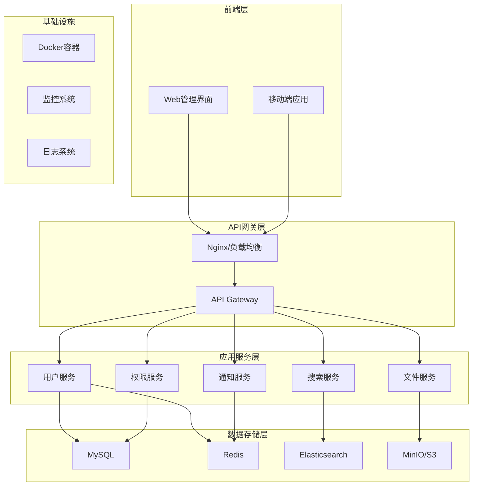
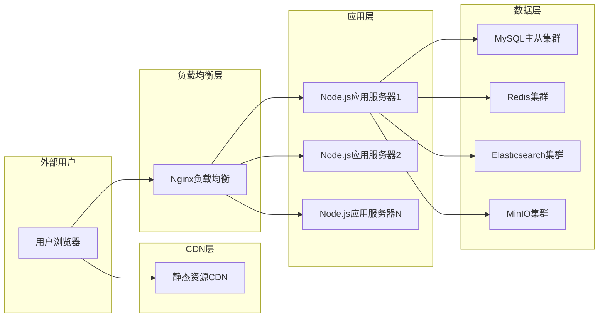

# DocSphere 系统架构设计

## 系统概述

DocSphere 是一款专为现代企业设计的智能文档管理系统，采用前后端分离架构，提供企业级文件存储、协作和管理功能。系统设计理念是"连接人与知识"，通过智能的权限管理和搜索功能，确保正确的信息能够及时送达需要它的人手中。

## 核心功能

### 1. 多用户协作与权限控制
- 基于角色的权限管理（RBAC）
- 细粒度的资源级权限控制
- 用户组和部门管理
- 权限继承和权限回收

### 2. 文件管理
- 文件上传、下载、预览
- 多种文件格式支持
- 文件版本控制
- 文件搜索和分类
- 批量操作支持

### 3. 协作功能
- 文件分享链接
- 协作编辑
- 评论和标注
- 操作日志记录

### 4. 后台管理
- 用户管理
- 系统监控
- 数据统计
- 审计日志

## 系统架构

### 整体架构图

### 技术架构特点

#### 1. 微服务架构
- 各功能模块独立部署，便于扩展和维护
- 服务间通过API进行通信
- 支持水平扩展和负载均衡

#### 2. 容器化部署
- 使用Docker容器化技术
- Kubernetes编排管理
- 支持自动化部署和扩展

#### 3. 数据分离
- 业务数据使用MySQL关系型数据库
- 缓存数据使用Redis
- 搜索功能使用Elasticsearch
- 文件存储使用对象存储服务

#### 4. 安全设计
- JWT认证机制
- HTTPS加密传输
- 数据库加密存储
- 操作审计日志

## 部署架构

### 生产环境部署

## 性能指标

### 系统目标
- **并发用户**: 支持1000+并发用户
- **文件上传**: 支持大文件上传（最大2GB）
- **响应时间**: API响应时间<200ms
- **可用性**: 99.9%系统可用性
- **存储容量**: 支持PB级文件存储

### 性能优化策略
1. **缓存策略**: Redis缓存热点数据
2. **数据库优化**: 索引优化和读写分离
3. **CDN加速**: 静态资源CDN分发
4. **异步处理**: 文件处理任务异步化

## 扩展性设计

### 水平扩展
- 应用服务器无状态设计
- 数据库分片策略
- 缓存集群扩展

### 功能扩展
- 插件化架构设计
- API版本管理
- 第三方系统集成接口

## 安全架构

### 安全防护措施
1. **认证授权**: JWT + OAuth2.0
2. **数据传输**: HTTPS + TLS 1.3
3. **数据存储**: 数据库字段加密
4. **访问控制**: IP白名单和流量控制
5. **安全审计**: 完整的操作日志记录

### 安全最佳实践
- 定期安全漏洞扫描
- 密码策略强制执行
- 多因素认证支持
- 数据备份和恢复机制