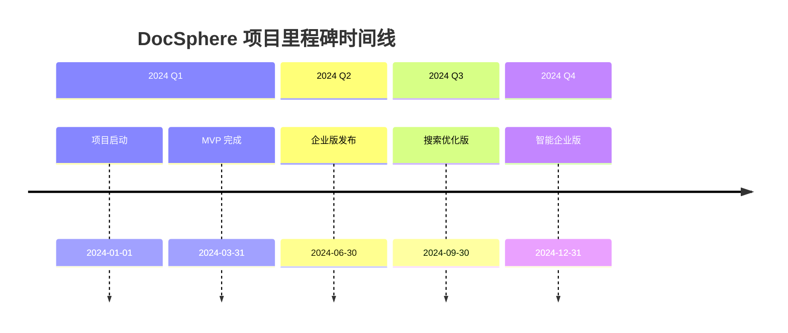

# 里程碑计划

## 🎯 里程碑定义

里程碑是项目开发过程中的重要检查点，用于评估项目进展、调整计划和确保项目按时交付。每个里程碑都有明确的交付物和验收标准。

## 📅 里程碑时间线

## 🏁 里程碑详情

### 里程碑 1: 项目启动 (M1)

**时间**: 2024年1月1日 - 2024年1月7日 (1周)

**目标**: 建立项目基础，完成开发环境搭建

**交付物**:
- [x] 项目文档体系建立
- [x] 开发环境配置
- [x] 代码仓库初始化
- [x] 团队协作工具搭建
- [x] 技术架构确认

**验收标准**:
- ✅ 文档体系完整且清晰
- ✅ 开发环境可以正常运行
- ✅ 代码规范和工具链配置完成
- ✅ 团队成员具备开发能力

**风险和缓解措施**:
- 风险: 环境配置复杂，耗时过长
- 缓解: 提供详细的环境配置文档，使用 Docker 容器化

---

### 里程碑 2: MVP 核心功能 (M2)

**时间**: 2024年3月31日 (第8周)

**目标**: 完成最小可行产品，支持基础的文件管理功能

**关键功能**:
- [ ] 用户注册、登录、认证
- [ ] 文件上传、下载、删除
- [ ] 基础文件夹管理
- [ ] 简单权限控制
- [ ] Web 用户界面

**技术交付物**:
- [ ] 后端 API 服务
- [ ] 前端 React 应用
- [ ] 数据库表结构和迁移脚本
- [ ] Docker 部署配置
- [ ] API 文档

**验收标准**:
- **功能完整性**:
  - ✅ 用户可以注册、登录
  - ✅ 用户可以上传、下载、删除文件
  - ✅ 支持文件夹创建和基本管理
  - ✅ 基础权限控制工作正常

- **性能要求**:
  - ✅ API 响应时间 < 500ms (95th percentile)
  - ✅ 文件上传速度 > 5MB/s
  - ✅ 支持并发用户数 > 50

- **质量要求**:
  - ✅ 代码测试覆盖率 > 70%
  - ✅ 无严重安全漏洞
  - ✅ 主要浏览器兼容性良好

**演示场景**:
1. 用户注册并登录系统
2. 上传多个文件到系统
3. 创建文件夹并移动文件
4. 设置文件夹访问权限
5. 下载和删除文件

---

### 里程碑 3: 企业基础版 (M3)

**时间**: 2024年6月30日 (第24周)

**目标**: 增加企业级功能，提升系统稳定性和安全性

**新增功能**:
- [ ] 角色权限管理系统 (RBAC)
- [ ] 部门和用户组管理
- [ ] 文件分享功能
- [ ] 操作审计日志
- [ ] 系统监控和统计
- [ ] 数据备份和恢复

**增强功能**:
- [ ] 批量文件操作
- [ ] 文件搜索功能
- [ ] 文件预览支持
- [ ] 移动端适配
- [ ] 高级安全设置

**技术改进**:
- [ ] 数据库性能优化
- [ ] 缓存策略优化
- [ ] API 性能提升
- [ ] 错误处理完善
- [ ] 日志系统增强

**验收标准**:
- **功能要求**:
  - ✅ 支持复杂的权限管理体系
  - ✅ 文件分享链接正常工作
  - ✅ 系统监控指标完整
  - ✅ 操作日志记录准确

- **性能要求**:
  - ✅ API 响应时间 < 300ms (95th percentile)
  - ✅ 文件上传速度 > 10MB/s
  - ✅ 支持并发用户数 > 200

- **安全要求**:
  - ✅ 通过安全渗透测试
  - ✅ 数据传输全程加密
  - ✅ 敏感操作有审计记录

**演示场景**:
1. 管理员创建角色和分配权限
2. 用户部门管理和组织架构设置
3. 创建文件分享链接并设置访问权限
4. 查看系统使用统计和操作日志
5. 移动端访问和使用

---

### 里程碑 4: 搜索优化版 (M4)

**时间**: 2024年9月30日 (第36周)

**目标**: 大幅提升搜索功能和文件处理能力

**核心功能**:
- [ ] 全文搜索引擎 (Elasticsearch)
- [ ] 高级搜索和筛选
- [ ] 智能文件分类
- [ ] 文件内容索引
- [ ] 搜索结果排序优化

**文件处理增强**:
- [ ] 多格式文件预览
- [ ] 文档转换服务
- [ ] OCR 文字识别
- [ ] 文件元数据提取
- [ ] 图片和视频缩略图

**用户体验优化**:
- [ ] 智能推荐系统
- [ ] 搜索历史管理
- [ ] 快捷键支持
- [ ] 拖拽操作增强
- [ ] 界面响应优化

**验收标准**:
- **搜索功能**:
  - ✅ 全文搜索准确率 > 95%
  - ✅ 搜索响应时间 < 1秒
  - ✅ 支持复杂查询语法
  - ✅ 搜索结果排序合理

- **文件处理**:
  - ✅ 支持 20+ 文件格式预览
  - ✅ 图片缩略图生成 < 2秒
  - ✅ 文档转换成功率 > 98%

- **用户体验**:
  - ✅ 页面加载时间 < 2秒
  - ✅ 操作响应时间 < 200ms
  - ✅ 移动端体验流畅

**演示场景**:
1. 全文搜索文件内容
2. 高级筛选和排序
3. 多格式文件在线预览
4. OCR 识别图片文字
5. 智能文件分类和标签

---

### 里程碑 5: 智能企业版 (M5)

**时间**: 2024年12月31日 (第48周)

**目标**: 引入 AI 功能，实现智能化文档管理

**AI 智能功能**:
- [ ] 文档智能分类和标签
- [ ] 内容摘要生成
- [ ] 重复文件检测
- [ ] 智能搜索建议
- [ ] 文档相似度分析

**协作功能**:
- [ ] 实时协作编辑
- [ ] 评论和批注系统
- [ ] 版本控制和历史
- [ ] 工作流程管理
- [ ] 审批流程设置

**移动端完整支持**:
- [ ] React Native 移动应用
- [ ] 离线访问支持
- [ ] 推送通知系统
- [ ] 文件同步服务
- [ ] 移动端专属功能

**开放平台**:
- [ ] RESTful API 开放
- [ ] Webhook 支持
- [ ] SDK 和开发工具
- [ ] 第三方集成示例
- [ ] 插件系统基础

**验收标准**:
- **AI 功能**:
  - ✅ 文档分类准确率 > 90%
  - ✅ 摘要生成质量满足需求
  - ✅ 重复检测准确率 > 95%

- **协作功能**:
  - ✅ 实时编辑延迟 < 100ms
  - ✅ 支持 100+ 并发协作用户
  - ✅ 版本控制系统稳定

- **移动端**:
  - ✅ 应用商店发布审核通过
  - ✅ 离线功能正常工作
  - ✅ 推送通知送达率 > 95%

**演示场景**:
1. AI 自动分类和标签文件
2. 生成文档摘要
3. 多人实时协作编辑
4. 移动端离线使用
5. 第三方应用集成

---

## 📊 里程碑监控

### 关键绩效指标 (KPI)

**进度指标**:
- 里程碑按时完成率
- 任务完成率
- 代码提交频率
- 缺陷修复率

**质量指标**:
- 代码覆盖率
- 缺陷密度
- 用户满意度
- 系统可用性

**效率指标**:
- 开发速度
- 功能交付周期
- 重工率
- 团队生产力

### 监控工具

**项目管理**:
- GitHub Projects / Jira
- 甘特图和时间线
- 燃尽图和累积流图
- 风险注册表

**质量监控**:
- SonarQube (代码质量)
- CodeClimate (技术债)
- 自动化测试报告
- 性能监控仪表板

**团队协作**:
- 每日站会记录
- 周报和月报
- 回顾会议纪要
- 知识分享会

### 风险管理

**常见风险**:
- 技术风险: 技术选型错误、性能瓶颈
- 资源风险: 人员流动、资源不足
- 时间风险: 需求变更、技术债务
- 质量风险: 缺陷泄露、安全事故

**应对策略**:
- 定期风险评估
- 应急预案制定
- 关键路径监控
- 备选方案准备

## 🎯 成功标准

### 项目成功指标

**技术成功**:
- ✅ 所有里程碑按时完成
- ✅ 系统性能达到设计目标
- ✅ 代码质量符合标准
- ✅ 安全性通过评估

**业务成功**:
- ✅ 用户满意度 > 85%
- ✅ 系统稳定性 > 99.5%
- ✅ 功能完整性满足需求
- ✅ 可扩展性得到验证

**团队成功**:
- ✅ 团队协作顺畅
- ✅ 技术能力提升
- ✅ 经验积累和传承
- ✅ 流程优化建立

通过这套完整的里程碑计划，我们可以确保项目有序推进，及时发现问题并调整策略，最终成功交付高质量的 DocSphere 系统。