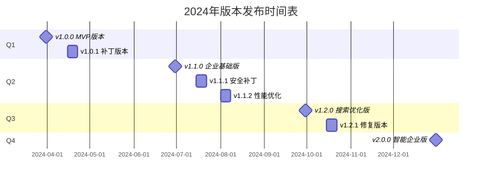

# 版本发布计划

## 📋 版本管理策略

DocSphere 采用语义化版本控制 (Semantic Versioning) 和敏捷发布策略，确保新功能能够及时交付给用户，同时保持系统的稳定性。

## 🎯 版本发布周期

### 发布类型和频率

**补丁版本 (Patch Releases)**
- 频率: 根据需要随时发布
- 内容: Bug 修复、安全补丁、性能优化
- 例子: v1.0.1 → v1.0.2

**次要版本 (Minor Releases)**
- 频率: 每 4-6 周一次
- 内容: 新功能、功能增强、向后兼容的改进
- 例子: v1.0.0 → v1.1.0

**主要版本 (Major Releases)**
- 频率: 每 6-12 个月一次
- 内容: 重大功能、架构变更、不兼容的更新
- 例子: v1.0.0 → v2.0.0

### 发布时间表



## 🚀 版本详细规划

### v1.0.0 - MVP 版本 (2024-03-31)

**版本类型**: 主要版本
**目标用户**: 早期采用者、小型团队

**核心功能**:
- ✅ 用户注册、登录、认证系统
- ✅ 基础文件管理 (上传、下载、删除)
- ✅ 简单文件夹管理
- ✅ 基础权限控制
- ✅ Web 用户界面

**技术特性**:
- Node.js + React 技术栈
- MySQL 数据库
- Redis 缓存
- MinIO 文件存储
- JWT 认证

**发布清单**:
- [ ] 功能测试完成
- [ ] 性能测试通过
- [ ] 安全审查完成
- [ ] 文档更新完成
- [ ] 部署脚本准备
- [ ] 发布说明编写

**发布后计划**:
- 用户反馈收集
- 问题监控和修复
- v1.0.1 补丁版本规划

---

### v1.1.0 - 企业基础版 (2024-06-30)

**版本类型**: 次要版本
**目标用户**: 中小型企业

**新增功能**:
- 🔄 角色权限管理系统 (RBAC)
- 🔄 部门和用户组管理
- 🔄 文件分享功能 (链接分享)
- 🔄 操作审计日志
- 🔄 系统监控仪表板
- 🔄 批量文件操作

**增强功能**:
- 🔄 文件搜索功能 (基础)
- 🔄 文件预览支持 (PDF、图片)
- 🔄 移动端基础适配
- 🔄 高级安全设置

**技术改进**:
- 数据库性能优化
- API 响应速度提升
- 缓存策略优化
- 错误处理完善

**发布策略**:
- 提前 2 周功能冻结
- Beta 版本测试 (v1.1.0-beta)
- 向后兼容性验证
- 平滑升级方案

---

### v1.2.0 - 搜索优化版 (2024-09-30)

**版本类型**: 次要版本
**目标用户**: 中大型企业

**核心新增**:
- 🔄 Elasticsearch 全文搜索
- 🔄 高级搜索和筛选
- 🔄 文件内容索引
- 🔄 智能文件分类
- 🔄 多格式文件预览
- 🔄 文件元数据提取

**体验优化**:
- 🔄 搜索结果排序算法优化
- 🔄 用户界面响应性提升
- 🔄 拖拽操作增强
- 🔄 快捷键支持
- 🔄 个性化设置

**性能提升**:
- 🔄 搜索响应时间 < 1秒
- 🔄 文件预览加载优化
- 🔄 大列表虚拟滚动
- 🔄 图片懒加载

---

### v2.0.0 - 智能企业版 (2024-12-31)

**版本类型**: 主要版本
**目标用户**: 大型企业

**重大功能**:
- 🔄 AI 文档智能分析
- 🔄 实时协作编辑
- 🔄 版本控制系统
- 🔄 React Native 移动应用
- 🔄 开放 API 平台
- 🔄 工作流程管理

**架构升级**:
- 微服务架构重构
- 数据库分片支持
- 容器化部署优化
- 监控系统增强

**不兼容变更**:
- API 版本升级到 v2
- 部分配置文件格式变更
- 最低系统要求提升

**迁移支持**:
- v1.x → v2.0 数据迁移工具
- API 兼容性适配器
- 详细迁移指南
- 30天并行支持期

---

## 🔧 发布流程

### 开发阶段 (Feature Development)

**时间**: 版本发布前 2-4 周

**活动**:
- 功能开发和单元测试
- 代码审查和重构
- 文档更新
- 性能基准测试

**准入条件**:
- 所有功能开发完成
- 单元测试覆盖率 > 80%
- 代码审查通过
- 性能测试达标

### 集成阶段 (Integration & Testing)

**时间**: 版本发布前 1-2 周

**活动**:
- 功能集成测试
- 端到端测试
- 性能和压力测试
- 安全测试
- 用户验收测试

**验收标准**:
- 所有测试用例通过
- 性能指标达到要求
- 安全扫描通过
- 用户验收完成

### 准备阶段 (Release Preparation)

**时间**: 版本发布前 3-7 天

**活动**:
- 版本号更新
- 变更日志编写
- 发布说明准备
- 部署脚本验证
- 回滚方案准备

**发布包检查**:
- 完整性验证
- 病毒扫描
- 签名验证
- 安装测试

### 发布阶段 (Release Deployment)

**发布日流程**:
1. **发布前检查** (T-2小时)
   - 系统状态确认
   - 监控系统检查
   - 团队成员就位

2. **功能冻结** (T-1小时)
   - 停止代码合并
   - 创建发布分支
   - 最终构建验证

3. **发布执行** (T=0)
   - 数据库迁移
   - 应用程序部署
   - 配置更新
   - 服务重启

4. **发布验证** (T+30分钟)
   - 功能验证测试
   - 性能指标检查
   - 错误日志监控
   - 用户反馈收集

### 发布后阶段 (Post-Release)

**24小时内**:
- 系统稳定性监控
- 用户问题快速响应
- 热修复准备

**1周内**:
- 用户反馈收集分析
- 性能数据统计
- 问题修复优先级排序
- 下一版本规划

## 📦 版本包管理

### 版本号规范

**格式**: `MAJOR.MINOR.PATCH[-PRERELEASE][+BUILD]`

**示例**:
- `1.0.0` - 正式版本
- `1.1.0-beta.1` - Beta 测试版
- `1.2.0-rc.2` - 候选版本
- `1.2.1+20231215` - 构建版本

### 包命名规范

**Docker 镜像**:
```
docsphere/backend:1.0.0
docsphere/backend:latest
docsphere/backend:1.0
```

**NPM 包**:
```
@docsphere/core:1.0.0
@docsphere/cli:1.0.0-beta.1
```

**下载包**:
```
docsphere-server-1.0.0-linux-x64.tar.gz
docsphere-client-1.0.0-windows-x64.exe
```

## 🔄 升级和迁移策略

### 向后兼容性

**API 兼容性**:
- 主版本间不保证兼容
- 次版本间向后兼容
- 补丁版本完全兼容

**数据兼容性**:
- 提供数据迁移工具
- 支持版本回退
- 自动化迁移脚本

### 升级路径

**v1.0 → v1.1 (小版本升级)**:
```bash
# 停止服务
systemctl stop docsphere

# 备份数据
mysqldump -u root -p docsphere > backup.sql

# 更新应用
docker pull docsphere/server:1.1.0

# 启动服务
systemctl start docsphere
```

**v1.x → v2.0 (大版本升级)**:
```bash
# 导出现有数据
./docsphere export --version 1.x --output export.json

# 安装新版本
./docsphere-installer-v2.0.0.sh

# 导入数据
./docsphere import --version 2.0 --input export.json

# 验证数据完整性
./docsphere verify --check-data
```

## 📊 发布监控

### 关键指标

**技术指标**:
- 部署成功率 > 99%
- 发布后错误率 < 1%
- 回滚率 < 5%
- 用户投诉 < 10个

**业务指标**:
- 新版本采用率
- 用户活跃度变化
- 功能使用统计
- 性能指标对比

### 监控工具

**系统监控**:
- 应用性能监控 (APM)
- 错误追踪系统
- 日志分析平台
- 基础设施监控

**用户反馈**:
- 用户行为分析
- 支持工单统计
- 社区反馈收集
- 应用商店评价

## 🚨 应急响应

### 回滚触发条件

**自动触发**:
- 错误率 > 5%
- 响应时间 > 2秒
- 系统可用性 < 99%

**手动触发**:
- 严重安全漏洞
- 数据损坏问题
- 核心功能故障
- 大量用户投诉

### 回滚流程

**快速回滚** (5分钟内):
```bash
# 切换到上一个版本
kubectl rollout undo deployment/docsphere
# 或
docker-compose down
docker-compose up -d --image docsphere/server:1.0.0
```

**完整回滚** (30分钟内):
1. 停止当前版本
2. 恢复数据备份
3. 部署稳定版本
4. 验证系统功能
5. 通知用户

## 📚 发布沟通

### 沟通计划

**发布前**:
- 内部团队通知 (提前1周)
- 客户提前通知 (提前3天)
- 发布时间确认
- 维护窗口公告

**发布中**:
- 状态页面更新
- 社交媒体通知
- 客服团队准备
- 技术支持待命

**发布后**:
- 发布公告发布
- 更新日志发布
- 客户教育材料
- 培训视频录制

### 发布模板

**公告模板**:
```markdown
# DocSphere v{version} 发布公告

## 🎉 主要更新
- [功能1]: 描述
- [功能2]: 描述

## 📦 下载地址
- [下载链接]
- [安装指南]

## 📋 升级说明
[升级步骤和注意事项]

## 🐛 已知问题
[已知问题和解决方案]

## 💬 支持反馈
- 支持邮箱
- 在线客服
- 社区论坛
```

通过这套完整的版本发布计划，我们可以确保 DocSphere 的每个版本都能按时、高质量地交付给用户，同时保持系统的稳定性和可靠性。