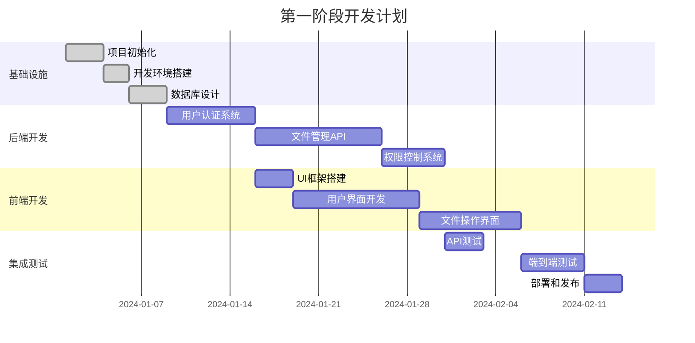

# DocSphere 项目路线图

## 🗺️ 项目总览

DocSphere 是一个企业级文档管理系统，旨在为现代企业提供安全、高效、易用的文档管理和协作解决方案。本文档详细描述了项目的发展路线图、关键里程碑和实现计划。

## 🎯 项目愿景

**短期目标** (3-6个月)
- 完成核心文档管理功能
- 建立稳定的用户认证和权限系统
- 提供基础的文件分享和协作功能

**中期目标** (6-12个月)
- 扩展高级搜索和智能分类功能
- 实现完整的版本控制系统
- 提供企业级管理后台和统计分析

**长期目标** (1-2年)
- 集成AI驱动的智能文档处理
- 建立开放平台和生态系统
- 支持大规模企业级部署和定制

## 📅 开发阶段规划

### 第一阶段：MVP 核心功能 (2024 Q1)

#### 目标
建立最小可行产品，包含用户管理和基础文件操作功能

#### 主要功能

#### 详细任务分解

**第1-2周：基础设施**
- [x] 项目初始化和目录结构创建
- [x] 开发环境配置（Node.js、数据库、缓存）
- [x] 代码规范和工具链配置（ESLint、Prettier、Git hooks）
- [x] CI/CD 流水线搭建
- [x] 数据库设计和初始化脚本

**第3-4周：后端核心功能**
- [ ] 用户注册、登录、认证系统（JWT）
- [ ] 基础文件上传、下载、删除功能
- [ ] 文件夹创建和管理
- [ ] 基础权限控制（读写权限）
- [ ] API 文档生成

**第5-6周：前端界面开发**
- [ ] React 项目初始化和路由配置
- [ ] UI 组件库集成（Ant Design）
- [ ] 登录注册界面
- [ ] 文件管理界面（列表、网格视图）
- [ ] 文件上传组件（拖拽支持）

**第7-8周：集成和测试**
- [ ] 前后端接口联调
- [ ] 用户权限功能测试
- [ ] 文件操作功能测试
- [ ] 性能优化和错误处理
- [ ] Docker 容器化部署

### 第二阶段：企业级功能 (2024 Q2)

#### 目标
增加企业级功能，提升系统稳定性和可扩展性

#### 主要功能模块

**1. 高级文件管理**
- 文件版本控制和历史记录
- 文件预览（PDF、图片、视频）
- 批量操作（批量上传、删除、移动）
- 文件标签和元数据管理

**2. 权限系统增强**
- 角色权限管理（RBAC）
- 部门和用户组管理
- 权限继承和委托
- 操作审计日志

**3. 分享和协作**
- 文件分享链接（密码保护、有效期）
- 协作编辑和评论功能
- 实时通知系统
- 外部用户邀请

**4. 搜索功能**
- 全文搜索（Elasticsearch）
- 高级筛选和排序
- 搜索历史和推荐
- AI 辅助搜索

### 第三阶段：智能化和生态 (2024 Q3-Q4)

#### 目标
引入智能功能和开放平台

#### 主要功能

**1. AI 智能功能**
- 文档智能分类
- 内容提取和识别
- 智能推荐系统
- 自动标签生成

**2. 高级协作**
- 实时协作编辑
- 版本冲突解决
- 评论和讨论系统
- 工作流程管理

**3. 移动端支持**
- React Native 移动应用
- 移动端文件同步
- 离线访问支持
- 推送通知

**4. 开放平台**
- RESTful API 开放
- Webhook 支持
- 第三方集成（Office 365、Google Workspace）
- 插件系统

## 🎯 版本发布计划

### v1.0.0 - MVP 版本 (2024年3月)
**目标用户**: 小型团队和早期采用者
**核心功能**:
- ✅ 用户管理
- ✅ 基础文件操作
- ✅ 简单权限控制
- ✅ Web 界面

### v1.1.0 - 企业基础版 (2024年5月)
**目标用户**: 中小型企业
**新增功能**:
- 🔄 角色权限管理
- 🔄 部门管理
- 🔄 文件分享
- 🔄 操作日志

### v1.2.0 - 搜索优化版 (2024年7月)
**目标用户**: 中大型企业
**新增功能**:
- 🔄 全文搜索
- 🔄 高级筛选
- 🔄 文件预览
- 🔄 批量操作

### v2.0.0 - 智能企业版 (2024年10月)
**目标用户**: 大型企业
**新增功能**:
- 🔄 AI 智能分类
- 🔄 版本控制
- 🔄 实时协作
- 🔄 移动端支持

### v3.0.0 - 开放平台版 (2025年3月)
**目标用户**: 所有规模企业
**新增功能**:
- 🔄 开放 API
- 🔄 插件系统
- 🔄 第三方集成
- 🔄 自定义工作流

## 📊 关键指标

### 技术指标

**性能目标**
- API 响应时间: < 200ms (95th percentile)
- 文件上传速度: > 10MB/s
- 系统可用性: 99.9%
- 并发用户数: 1000+

**质量目标**
- 代码覆盖率: > 80%
- 安全漏洞: 0 (高危)
- API 文档覆盖率: 100%

### 业务指标

**用户指标**
- 用户注册转化率: > 15%
- 用户活跃度: > 60% (月活跃)
- 用户留存率: > 80% (月度)

**功能指标**
- 文件上传成功率: > 99%
- 搜索准确率: > 95%
- 权限响应时间: < 100ms

## 🚀 技术演进计划

### 架构演进

**当前阶段 (v1.x)**
- 单体应用架构
- 关系型数据库 (MySQL)
- 基础缓存 (Redis)

**中期阶段 (v2.x)**
- 微服务架构
- 读写分离
- 分布式缓存
- 消息队列

**长期阶段 (v3.x)**
- 云原生架构
- 容器编排 (Kubernetes)
- 服务网格
- 边缘计算支持

### 技术栈升级

**后端技术**
- 升级到最新稳定版本
- 引入 GraphQL
- 实现事件驱动架构
- 支持 gRPC

**前端技术**
- 升级到 React 19+
- 引入 WebAssembly
- 实现微前端架构
- 支持 PWA

**数据存储**
- 引入多数据库支持 (PostgreSQL, MongoDB)
- 实现数据湖架构
- 支持 AI 模型存储
- 实时数据同步

## 🏢 企业采用策略

### 目标市场

**第一阶段 (2024)**
- 创业公司和中小型企业 (50-500人)
- 技术团队为主
- 注重成本效益

**第二阶段 (2025)**
- 中大型企业 (500-5000人)
- 多部门协作需求
- 注重安全合规

**第三阶段 (2026+)**
- 大型企业 (5000+人)
- 全球化部署需求
- 高度定制化需求

### 销售策略

**产品定位**
- 开源免费版 (基础功能)
- 企业版 (高级功能和技术支持)
- 云服务版 (SaaS 部署)

**市场推广**
- 技术社区营销
- 开源项目推广
- 行业会议和展览
- 合作伙伴渠道

## 🔄 迭代开发流程

### 开发周期
- **Sprint 长度**: 2周
- **发布频率**: 每月一个小版本，每季度一个大版本
- **反馈收集**: 持续进行，每周整理

### 质量保证
- **代码审查**: 所有代码必须经过审查
- **自动化测试**: 测试覆盖率要求 > 80%
- **性能测试**: 每个版本发布前进行性能基准测试
- **安全扫描**: 定期进行安全漏洞扫描

### 部署策略
- **灰度发布**: 新功能先在测试环境验证
- **蓝绿部署**: 零停机时间部署
- **回滚机制**: 快速回滚到稳定版本
- **监控告警**: 实时监控系统健康状态

## 🌟 未来展望

### 技术创新
- **区块链集成**: 文件完整性和版权保护
- **AI 助手**: 智能文档处理和知识管理
- **AR/VR 支持**: 沉浸式文档体验
- **量子加密**: 终极安全保护

### 生态系统
- **开发者社区**: 建立活跃的开源社区
- **应用市场**: 第三方插件和集成
- **咨询服务**: 专业的实施和咨询服务
- **培训认证**: 用户和开发者认证体系

这个路线图将指导 DocSphere 项目的有序发展，确保我们能够持续为用户提供价值和创新的解决方案。