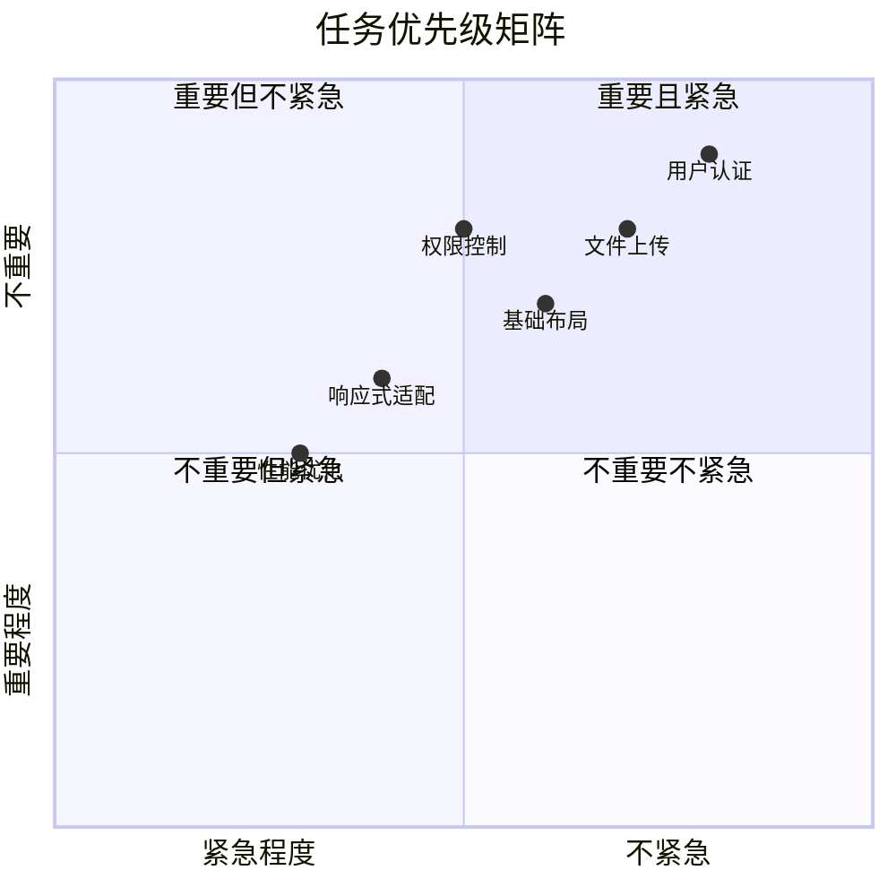

# 开发任务拆分指南

## 📋 任务拆分原则

### SMART 原则
- **Specific** (具体的): 每个任务都有明确的目标和交付物
- **Measurable** (可衡量的): 任务完成度可以被量化评估
- **Achievable** (可实现的): 任务在当前资源和时间内可以完成
- **Relevant** (相关的): 任务与项目目标直接相关
- **Time-bound** (有时限的): 每个任务都有明确的截止时间

### 拆分层次
```
项目 → 里程碑 → 功能模块 → 用户故事 → 开发任务 → 子任务
```

## 🎯 第一阶段任务拆分 (MVP)

### 后端开发任务

#### 1. 项目基础设施 (2人周)

**1.1 项目初始化 (0.5人天)**
- [ ] 创建项目目录结构
- [ ] 初始化 package.json 和依赖管理
- [ ] 配置 TypeScript 编译环境
- [ ] 设置 ESLint 和 Prettier
- [ ] 配置 Git hooks (husky + lint-staged)

**1.2 数据库设计 (1人天)**
- [ ] 设计用户表结构
- [ ] 设计文件表结构
- [ ] 设计权限表结构
- [ ] 编写数据库迁移脚本
- [ ] 创建测试数据种子

**1.3 基础服务框架 (0.5人天)**
- [ ] 创建 Express 应用骨架
- [ ] 配置中间件 (cors, helmet, morgan)
- [ ] 设置环境变量管理
- [ ] 配置日志系统
- [ ] 创建错误处理机制

#### 2. 用户认证系统 (1人周)

**2.1 JWT 认证实现 (2人天)**
- [ ] JWT token 生成和验证
- [ ] 密码加密和验证 (bcrypt)
- [ ] 刷新 token 机制
- [ ] 认证中间件
- [ ] 登录状态检查

**2.2 用户 API 开发 (3人天)**
- [ ] POST /api/auth/register - 用户注册
- [ ] POST /api/auth/login - 用户登录
- [ ] POST /api/auth/logout - 用户登出
- [ ] POST /api/auth/refresh - 刷新token
- [ ] GET /api/auth/profile - 获取用户信息
- [ ] PUT /api/auth/profile - 更新用户信息
- [ ] POST /api/auth/change-password - 修改密码

**2.3 输入验证和安全 (2人天)**
- [ ] 请求数据验证 (joi/yup)
- [ ] SQL 注入防护
- [ ] XSS 攻击防护
- [ ] CSRF 防护
- [ ] 请求频率限制

#### 3. 文件管理核心功能 (1.5人周)

**3.1 文件上传服务 (3人天)**
- [ ] Multer 中间件配置
- [ ] 文件类型验证
- [ ] 文件大小限制
- [ ] 文件存储服务 (MinIO)
- [ ] 文件元数据保存
- [ ] 分片上传支持
- [ ] 上传进度追踪

**3.2 文件 CRUD API (2人天)**
- [ ] GET /api/files - 获取文件列表
- [ ] GET /api/files/:id - 获取文件信息
- [ ] PUT /api/files/:id - 更新文件信息
- [ ] DELETE /api/files/:id - 删除文件
- [ ] GET /api/files/:id/download - 下载文件
- [ ] POST /api/files/search - 文件搜索

**3.3 文件夹管理 (2人天)**
- [ ] POST /api/folders - 创建文件夹
- [ ] GET /api/folders/:id - 获取文件夹内容
- [ ] PUT /api/folders/:id - 重命名文件夹
- [ ] DELETE /api/folders/:id - 删除文件夹
- [ ] POST /api/folders/:id/move - 移动文件夹

#### 4. 权限控制系统 (0.5人周)

**4.1 基础权限检查 (1人天)**
- [ ] 权限检查中间件
- [ ] 资源所有者验证
- [ ] 基础权限 CRUD API
- [ ] 权限继承逻辑
- [ ] 权限缓存机制

#### 5. API 文档和测试 (1人周)

**5.1 API 文档 (1人天)**
- [ ] Swagger/OpenAPI 配置
- [ ] API 文档生成
- [ ] 接口示例和说明
- [ ] 错误码文档

**5.2 单元测试 (3人天)**
- [ ] 用户认证服务测试
- [ ] 文件管理服务测试
- [ ] 权限控制测试
- [ ] 工具函数测试
- [ ] 测试覆盖率 > 80%

**5.3 集成测试 (1人天)**
- [ ] API 端到端测试
- [ ] 数据库集成测试
- [ ] 文件存储集成测试

### 前端开发任务

#### 1. 项目基础设施 (1人周)

**1.1 React 项目初始化 (0.5人天)**
- [ ] Vite + React + TypeScript 项目创建
- [ ] 路由配置 (React Router)
- [ ] 状态管理配置 (Redux Toolkit)
- [ ] HTTP 客户端配置 (Axios)
- [ ] UI 组件库集成 (Ant Design)

**1.2 开发工具配置 (0.5人天)**
- [ ] ESLint + Prettier 配置
- [ ] CSS 预处理器配置
- [ ] 开发服务器配置
- [ ] 热重载配置
- [ ] 构建优化配置

**1.3 基础布局组件 (2人天)**
- [ ] 主布局组件 (Header, Sidebar, Main)
- [ ] 导航菜单组件
- [ ] 面包屑导航组件
- [ ] 加载状态组件
- [ ] 错误边界组件

#### 2. 用户认证界面 (1人周)

**2.1 登录注册页面 (3人天)**
- [ ] 登录表单组件
- [ ] 注册表单组件
- [ ] 表单验证逻辑
- [ ] 密码强度检查
- [ ] 记住登录状态
- [ ] 登录错误处理

**2.2 用户状态管理 (2人天)**
- [ ] 用户认证 slice
- [ ] 登录状态持久化
- [ ] Token 刷新逻辑
- [ ] 权限状态管理
- [ ] 全局错误处理

#### 3. 文件管理界面 (1.5人周)

**3.1 文件列表组件 (3人天)**
- [ ] 文件列表组件 (列表视图)
- [ ] 文件网格视图组件
- [ ] 文件项组件
- [ ] 文件图标组件
- [ ] 分页组件
- [ ] 排序和筛选功能

**3.2 文件操作组件 (2人天)**
- [ ] 文件上传组件 (拖拽支持)
- [ ] 上传进度显示
- [ ] 文件预览组件
- [ ] 文件重命名功能
- [ ] 文件删除确认
- [ ] 批量操作功能

**3.3 文件夹管理 (2人天)**
- [ ] 文件夹树组件
- [ ] 面包屑导航
- [ ] 新建文件夹
- [ ] 文件夹重命名
- [ ] 文件夹删除
- [ ] 文件拖拽移动

#### 4. 响应式和优化 (0.5人周)

**4.1 响应式适配 (1人天)**
- [ ] 移动端适配
- [ ] 平板端适配
- [ ] 触摸操作优化
- [ ] 横屏适配

**4.2 性能优化 (1人天)**
- [ ] 组件懒加载
- [ ] 图片懒加载
- [ ] 虚拟滚动 (大列表)
- [ ] 缓存优化

## 📊 任务优先级矩阵



## 🎯 人员分配建议

### 团队角色
- **后端开发者** (1人): 负责 API 开发、数据库设计
- **前端开发者** (1人): 负责 UI 开发、用户体验
- **全栈开发者** (1人): 负责系统集成、部署运维

### 工作量估算
- **后端任务**: 4人周
- **前端任务**: 4人周
- **集成测试**: 1人周
- **总计**: 9人周 (约2.25个月)

## ⏰ 时间规划

### 第1-2周：基础设施
- 后端：项目初始化 + 数据库设计
- 前端：项目搭建 + 基础组件

### 第3-4周：核心功能
- 后端：用户认证 + 文件管理
- 前端：登录界面 + 文件列表

### 第5-6周：高级功能
- 后端：权限控制 + API 优化
- 前端：文件操作 + 文件夹管理

### 第7-8周：集成测试
- 前后端联调
- 功能测试
- 性能优化
- 部署准备

## 📋 任务跟踪

### 每日站会
- 昨天完成的工作
- 今天计划的工作
- 遇到的困难和障碍

### 周报模板
```markdown
## 本周完成
- [功能1] 完成情况
- [功能2] 完成情况

## 遇到的问题
- [问题描述]
- [解决方案]

## 下周计划
- [任务1] 预计完成时间
- [任务2] 预计完成时间
```

### 任务管理工具
- **项目管理**: GitHub Projects / Jira / Trello
- **代码管理**: Git + GitHub
- **文档管理**: Confluence / Notion
- **沟通工具**: Slack / 钉钉 / 微信群

## 🎯 验收标准

### 代码质量
- [ ] 代码覆盖率 > 80%
- [ ] 无严重代码质量问题
- [ ] 通过所有单元测试
- [ ] 通过集成测试

### 功能完整性
- [ ] 所有功能按需求实现
- [ ] 用户体验流畅
- [ ] 错误处理完善
- [ ] 性能指标达标

### 文档完整性
- [ ] API 文档完整
- [ ] 部署文档清晰
- [ ] 用户手册完善
- [ ] 开发文档规范

通过这样详细的任务拆分，我们可以确保项目有序推进，每个团队成员都清楚自己的职责和时间节点。